# 腾讯云 · 边缘安全加速解决方案
EdgeOne 是腾讯云推出的一款可以同时提供加速与安全能力的全新一代边缘平台，基于腾讯海量边缘节点, 提供域名解析、动静态智能加速、TCP/UDP 四层加速、DDoS/CC/Web/Bot 防护、边缘函数计算等边缘一体化服务，可帮助客户更快速、更安全、更灵活地响应用户请求。

## 产品特性
<p align="center">
  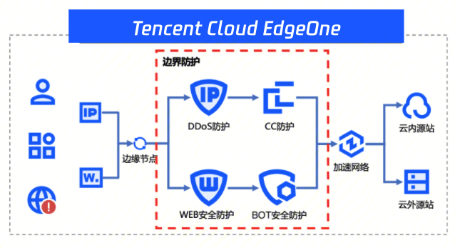
</p>

- **静态资源就近缓存**：我们集成传统 CDN 的能力, 在节点缓存热点资源, 在边缘直接响应客户的请求, 减少回源的比例, 解决源站带宽资源不足的问题.
- **动态资源智能加速**：我们支持动静态智能加速的能力, 用户就近访问我们的节点, 节点支持智能选路的能力, 选择最优的路径回源, 解决跨地域、跨运营商的网络问题
- **海量节点立体防护**：用户访问我们的节点来提供服务, 隐藏客户自己的源站地址, 保护源站免受恶意攻击, 而我们的节点则集成了腾讯沉淀多年的安全防护能力, 支持DDoS防护、CC防护、WAF、Bot防护等能力, 构筑起3-7层的立体防护能力
- **边缘能力自由组合**：我们通过先进的架构设计, 使得边缘可以支持更灵活的能力组合, 可以支持诸如域名解析服务、四层代理加速、边缘函数技术、规则引擎、别称域名等能力.

## 开始使用

- **Step0**：我们准备一个位于法兰克福的源站, 然后使用中东的客户端进行访问:

<details>
<summary> Go 客户端 </summary>

```
func main() {
	start := time.Now()
	body, _ := DoRequest("https://api.edgeone.cc/ping")
	elapsed := time.Since(start)
	fmt.Println("request without edgeone, use", elapsed)
	fmt.Println("response body:", body)
}

func DoRequest(url string) (string, error) {
	client := &http.Client{}
	request, err := http.NewRequest(http.MethodGet, url, nil)
	if err != nil {
		return "", err
	}
	rsp, err := client.Do(request)
	if err != nil {
		return "", err
	}

	body, err := ioutil.ReadAll(rsp.Body)
	return string(body), err
}
```
</details>

<details>
<summary> JavaScript 客户端 </summary>

```
var start = new Date().getTime()
var rsp = DoRequest(url = "https://api.edgeone.cc/ping")
var end = new Date().getTime()
console.log("request without edgeone, use", `${end - start}ms`)
console.log("response body:", rsp)

function DoRequest(url) {
    var xhr = new XMLHttpRequest();
    xhr.open(method = "get", url, async = false);
    xhr.send();
    return xhr.responseText;
}
```
</details>

<details>
<summary> Android 客户端(Java) </summary>

使用原生的 Java 网络库:
```
public class NativeEngine {
    public static String DoRequest(String url) {
        HttpURLConnection connection = null;
        InputStream is = null;
        BufferedReader br = null;
        String result = null;
        try {
            URL httpurl = new URL(url);
            connection = (HttpURLConnection) httpurl.openConnection();
            connection.setRequestMethod("GET");
            connection.setConnectTimeout(15000);
            connection.setReadTimeout(60000);
            connection.connect();
            if (connection.getResponseCode() == 200) {
                is = connection.getInputStream();
                br = new BufferedReader(new InputStreamReader(is, "UTF-8"));
                StringBuffer sbf = new StringBuffer();
                String temp = null;
                while ((temp = br.readLine()) != null) {
                    sbf.append(temp + "\n");
                }
                result = sbf.toString();
            }
        } catch (MalformedURLException e) {
            e.printStackTrace();
        } catch (IOException e) {
            e.printStackTrace();
        } finally {
            if (null != br) {
                try {
                    br.close();
                } catch (IOException e) {
                    e.printStackTrace();
                }
            }
            if (null != is) {
                try {
                    is.close();
                } catch (IOException e) {
                    e.printStackTrace();
                }
            }
            connection.disconnect();
        }
        return result;
    }
}
```

```
public class NativeActivity extends AppCompatActivity {
    private static final String TAG = "NativeActivity";

    @Override
    protected void onCreate(Bundle savedInstanceState) {
        super.onCreate(savedInstanceState);
        setContentView(R.layout.activity_edge_one);

        // Android4.0以后，为了防止网络请求时间过长而导致界面假死, 所以不允许在主线程（就是Activity）中发起HTTP请求, 这里为了方便测试, 进行一些特殊的配置
        StrictMode.ThreadPolicy policy = new StrictMode.ThreadPolicy.Builder().permitAll().build();
        StrictMode.setThreadPolicy(policy);

        long start = System.currentTimeMillis();
        NativeEngine nativeEngine = new NativeEngine();
        String rsp =  nativeEngine.DoRequest("https://api.edgeone.cc/ping");
        System.out.printf("request without edgeone, use %dms\n", System.currentTimeMillis() - start);
        System.out.printf("response body: %s\n", rsp);
    }
}
```
</details>

<details>
<summary> iOS 客户端(Swift) </summary>

```
struct ContentView: View {
    @ObservedObject var viewModel: NativeModel
    public init() {
        viewModel = NativeModel(url:"https://api.edgeone.cc/ping")
    }
    public var body: some View {
        VStack {
            Text("request without edgeone example")
            Button {
                viewModel.doRequest()
            } label: {
                Text("request")
                    .padding()
            }
            Text(viewModel.elapsed)
            Text(viewModel.result)
        }
    }
}

struct ContentView_Previews: PreviewProvider {
    static var previews: some View {
        ContentView()
    }
}

class NativeModel: ObservableObject {
    @Published var result: String = "no result"
    @Published var elapsed: String = "no result"
    
    let configuration: URLSessionConfiguration
    var httpUrl: URL
    init(url:String) {
        httpUrl = URL(string: url)!
        configuration = URLSessionConfiguration.default
    }

    func doRequest() {
        Task {
            let start = CFAbsoluteTimeGetCurrent()
            let session = URLSession(configuration: configuration)
            let response: (Data, URLResponse) = try! await session.data(from: httpUrl)
            result = String(data: response.0, encoding: .utf8) ?? "nil response"
            elapsed = "request use \((CFAbsoluteTimeGetCurrent()-start)*1000) ms"
        }
    }
}
```
</details>

以 Go 语言客户端为例, 运行:
<p align="center">
  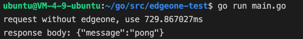
</p>
可以看到请求的耗时达到了 <strong>729ms</strong>, 客户使用会变得卡顿, 体验不佳, 现在我们将这个站点接入 EO, 尝试提高客户的使用体验

- **Step1**：添加站点. 登陆[边缘安全加速控制台](https://console.cloud.tencent.com/edgeone)，单击添加站点
<p align="center">
  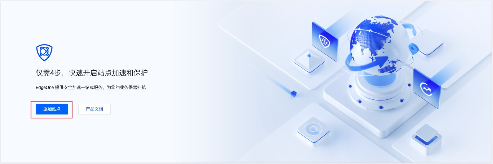
</p>

输入准备好的待接入站点域名，例如：edgeone.cc；单击下一步。
<p align="center">
  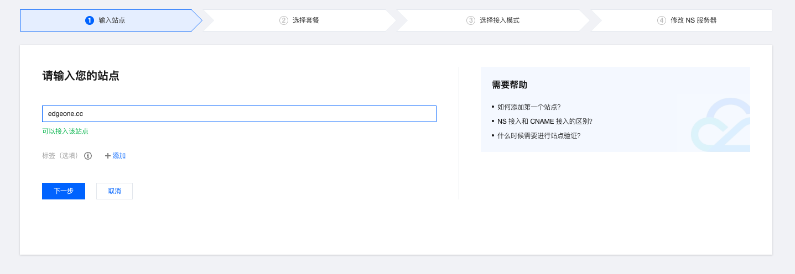
</p>

- **Step2**：选择对应的套餐
> 当您选择中国大陆可用区及全球可用区时，要求当前域名已完成工信部备案，如果域名未完成工信部备案，请参考[备案流程](https://cloud.tencent.com/document/product/243/18909)完成域名备案。
<p align="center">
  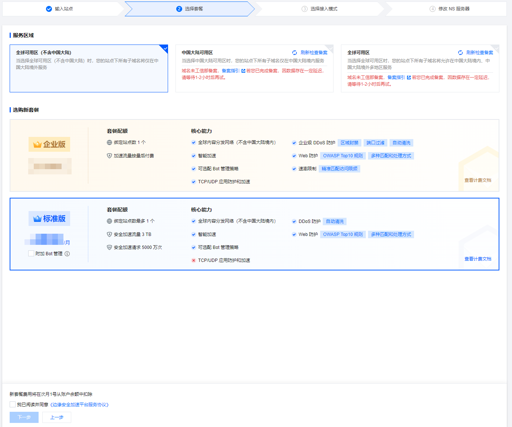
</p>

- **Step3**：选择接入模式, EdgeOne 支持[NS接入](https://cloud.tencent.com/document/product/1552/70825)或[CNAME接入](https://cloud.tencent.com/document/product/1552/70824), 两者对比如下:

| 模式 | NS 接入 | CNAME 接入 |
| :-------: | :------- | :------- |
| 适用场景  | 可修改原有域名解析服务商，将域名解析托管至 EdgeOne。   |  当前域名已托管在其他域名解析服务商处（例如：腾讯云DNSPod），不希望更改原有解析服务商。  |
| 接入方式  | 只需要去原域名解析服务商修改一次 DNS 服务器，托管域名解析后可针对域名一键开启安全加速。   |  每次新增子域名并开启加速时，都需要去相应的 DNS 解析服务商添加一次 CNAME 记录。  |
| 验证方式  | 需修改原有 NS 服务器至 EdgeOne 指定的地址。   |  通过添加 DNS 记录或者文本验证的方式验证主域名归属权。  |
| 调度方式  | 域名开启加速后，可通过 A 记录直接指向最近的 EdgeOne 边缘节点。   |  域名开启加速后，需通过 Cname 调度至最近的 EdgeOne 边缘节点。  |

这里以 CNAME 模式为例: 
1. 在选择接入模式中，选择 CNAME 接入，单击下一步。
2. CNAME 模式接入时需要您验证当前站点的归属权，您可以通过 DNS 解析验证和文件验证两种方式来进行校验，校验方法请参见[如何验证域名归属权](https://cloud.tencent.com/document/product/1552/70789)。
<p align="center">
  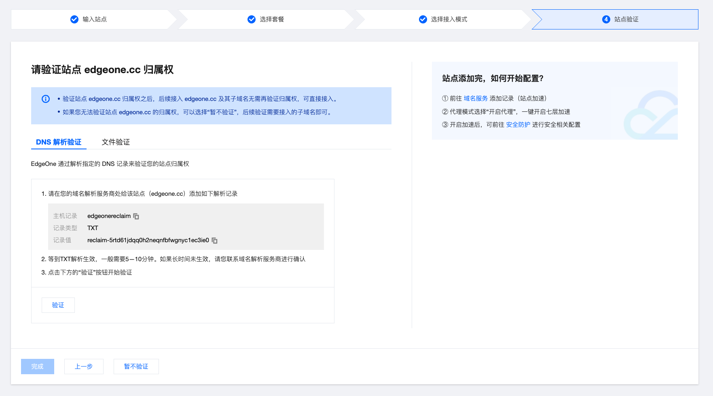
</p>

3. 归属权验证通过后，单击完成，即可完成站点添加。
<p align="center">
  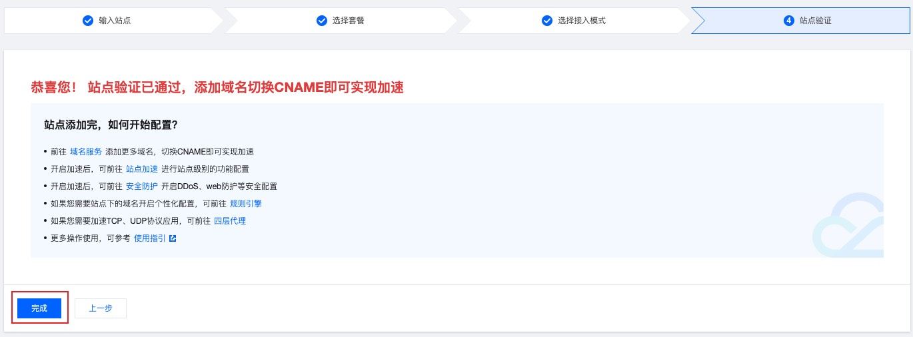
</p>

- **Step4**：添加加速域名:
单击左侧菜单栏的站点列表，选择所添加的站点，进入站点详情管理。
2. 单击域名服务 > 域名管理 进入域名管理详情页，单击添加域名，新增加速域名。
3. 填写需添加的加速域名以及对应的源站信息，单击下一步。
<p align="center">
  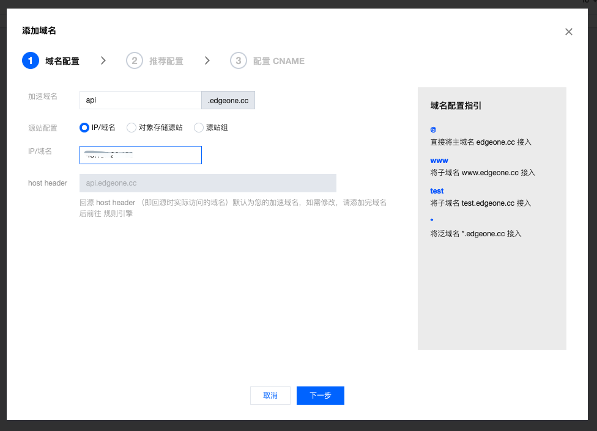
</p>

| 配置项 | 说明 |
| :-------: | :------- |
| 加速域名 | 用于提供给客户端访问的域名，填写域名对应的主机记录值即可，支持泛域名接入，如果需要接入主域名，请直接填写@即可。<br>例如：当前需添加的加速网站为 api.edgeone.cc，这里填写为 api 即可。|
| 源站配置 | 源站为客户端发起请求时，最终访问的资源地址，可选 IP/域名、对象存储源站、源站组三种方式：<br> * IP/域名：用于接入单个源站，可填写单个 IP 或单个域名作为源站 <br> * 对象存储源站：支持添加腾讯云 COS 源和 AWS S3 作为源站。 <br> * 源站组：如果源站为多个 IP，可通过配置源站组的方式添加。<br>例如：当前已有一个使用腾讯云服务器搭建的跨境电商网站，该服务器的 IP 地址：10.1.1.1。配置源站时，源站配置选择为 IP/域名，填写该服务器地址即可。|

4. 在添加域名时，EdgeOne 根据各个常见业务场景，为您提供了推荐配置，以保证您的业务更安全顺畅运行，您可以根据业务场景选择对应的推荐配置，单击下一步下发配置，或者直接单击跳过 ，不下发任何配置，直接进入下一步。
<p align="center">
  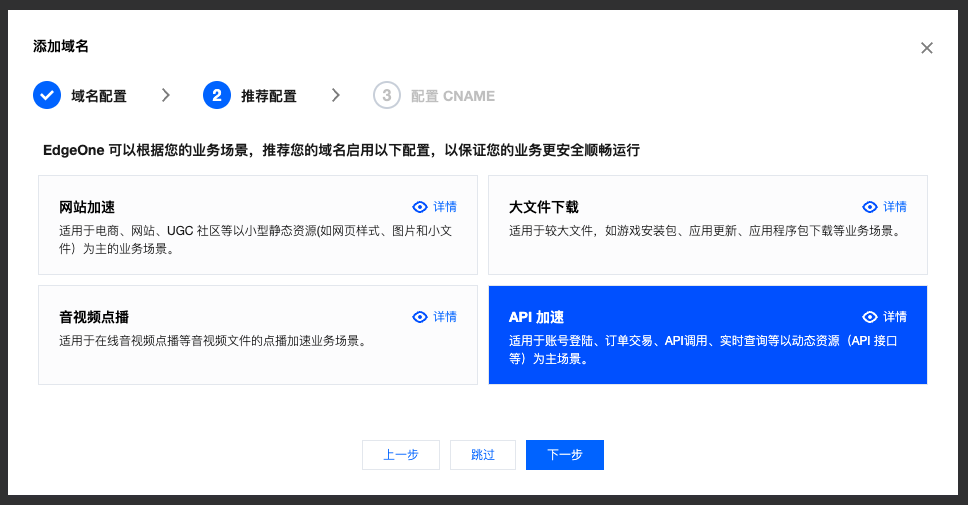
</p>

5. 之后平台将为您的域名分配一个 CNAME 地址，您需要在当前域名的解析服务商处为该域名添加配置 CNAME 解析记录。但是我们跳过这一步, 先进行一些配置的优化, 单击完成，完成加速域名添加。
<p align="center">
  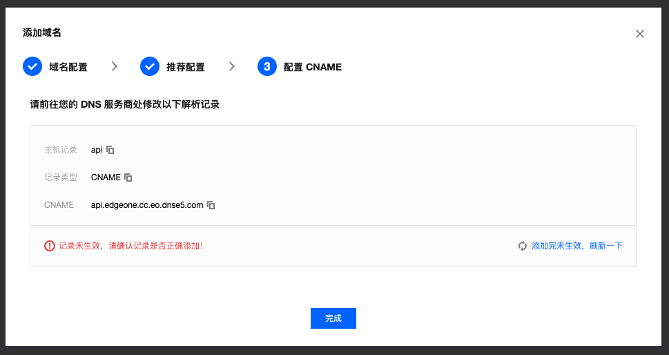
</p>

6. 域名添加以后, 我们可以在规则引擎里, 针对这个域名的具体场景进行一些配置的优化
<p align="center">
  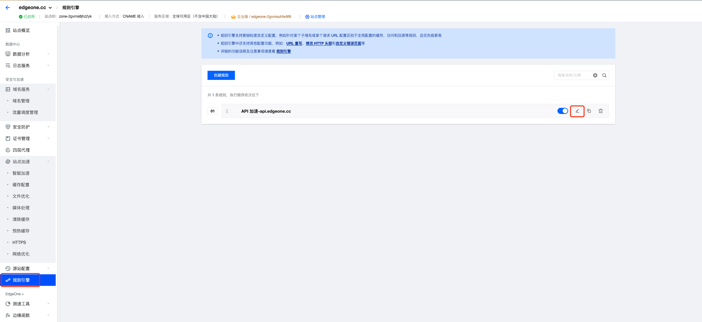
</p>

这里我们进行如下配置:
* 优化链路, 开启[智能加速](https://cloud.tencent.com/document/product/1552/70959), 启用此功能后，我们将实时检测节点网络延迟，通过智能算法选择最佳传输路径，以更快、更稳定、更安全的方式处理客户端用户的请求, 通过智能动态路由，将最大限度降低网络延迟、连接错误和请求失败等问题。
* 优化协议, 开启[HTTP/2](https://cloud.tencent.com/document/product/1552/70780)与[HTTP/3](https://cloud.tencent.com/document/product/1552/70781), 这是 HTTP 协议的升级版本, 支持并发, 大大减少传输和连接时的延时，避免网络拥塞，并且 Http3 基于 UDP 协议, 更是可以大幅提高弱网环境下的性能和稳定性。
* 优化[HTTPS](https://cloud.tencent.com/document/product/1552/88875), 通过[优化 TLS 版本](https://cloud.tencent.com/document/product/1552/86545)与[开启 OCSP 装订](https://cloud.tencent.com/document/product/1552/88879), 在保证安全的前提下, 实现了更高效的加密通信, 其中 HTTPS/3 与 TLS 1.3 的结合, 更是可以实现 [0-RTT](https://datatracker.ietf.org/doc/html/rfc9001#name-0-rtt) 的握手!

以上优化可以保证兼容性, 即使部分客户端不支持, 也可以协商到较低的协议版本完成请求

<p align="center">
  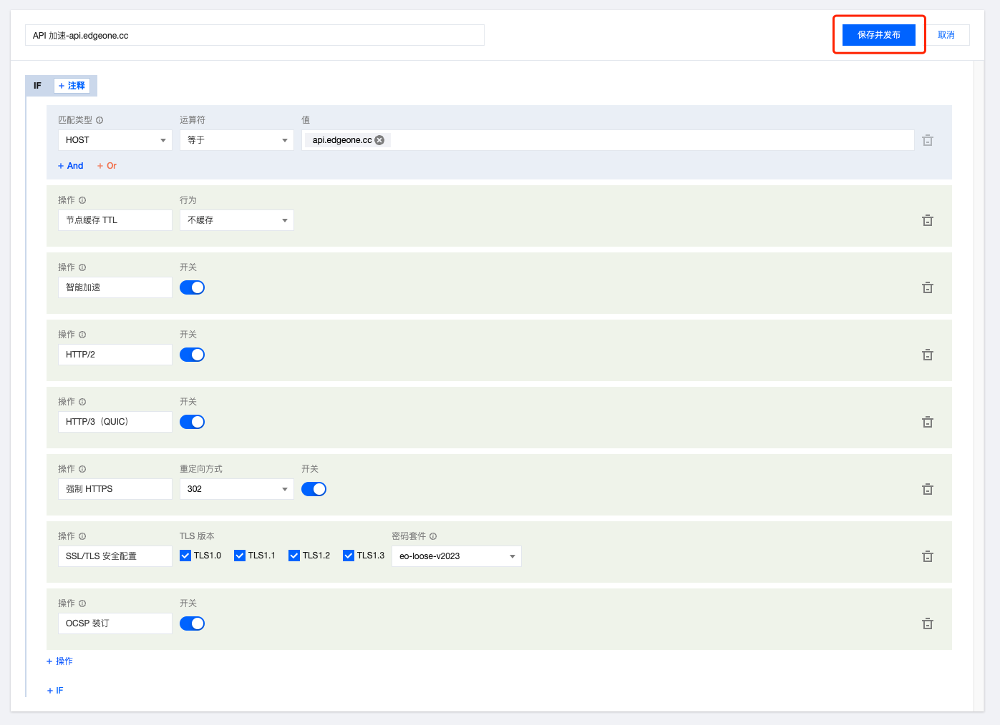
</p>

- **Step4**：访问测试，完成接入
1. 为了方便对比效果, 我们这里先不切换原域名的 CNAME, 而是通过直接访问 EdgeOne 提供的调度域名来进行对比:

<details>
<summary> Go 客户端 </summary>

Go 语言原生网络库暂不支持 HTTP/3, 推荐使用 [quic-go](https://github.com/quic-go/quic-go)

```
func main() {
	start := time.Now()
	body, _ := DoAdvRequest("https://api.edgeone.cc.eo.dnse5.com/ping", "api.edgeone.cc")
	elapsed := time.Since(start)
	fmt.Println("request with edgeone, use", elapsed)
	fmt.Println("response body:", body)
}

func DoAdvRequest(url string, host string) (string, error) {
	var qconf quic.Config
	client := &http.Client{
		Transport: &http3.RoundTripper{
			TLSClientConfig: &tls.Config{
				InsecureSkipVerify: true,
				MinVersion: tls.VersionTLS10,
				MaxVersion: tls.VersionTLS13,
			},
			QuicConfig:      &qconf,
		},
	}
	request, err := http.NewRequest(http.MethodGet, url, nil)
	if err != nil {
		return "", err
	}
	if host != "" {
		request.Host = host
	}
	rsp, err := client.Do(request)
	if err != nil {
		return "", err
	}

	body, err := ioutil.ReadAll(rsp.Body)
	return string(body), err
}
```

</details>

<details>
<summary> JavaScript 客户端 </summary>

因为浏览器限制, JS 没有办法直接通过修改 HOST 头部来访问我们的节点, 可以通过修改[本地Hosts]("https://zh.wikipedia.org/wiki/Hosts%E6%96%87%E4%BB%B6"), 将域名的解析直接指向我们的节点来进行对比
* 先 dig 我们的调度域名, 获取到具体的 IP:
<p align="center">
  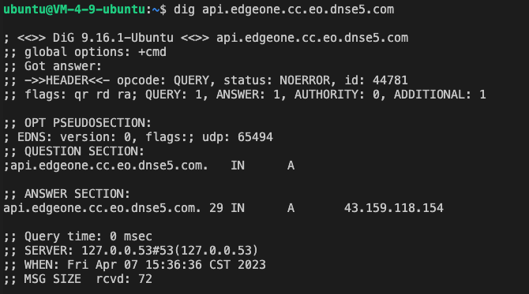
</p>

* 修改本地 Hosts:
```
sudo vim /etc/hosts
```
<p align="center">
  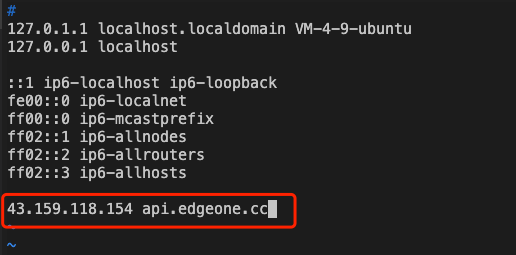
</p>
 
* 以 Chrome 为例, 开启浏览器的 [QUIC 支持](chrome://flags/#enable-quic)
* 发送请求

```
var start = new Date().getTime()
var rsp = DoRequest(url = "https://api.edgeone.cc/ping")
var end = new Date().getTime()
console.log("request with edgeone, use", `${end - start}ms`)
console.log("response body:", rsp)

function DoRequest(url) {
    var xhr = new XMLHttpRequest();
    xhr.open(method = "get", url, async = false);
    xhr.send();
    return xhr.responseText;
}
```
</details>

<details>
<summary> Android 客户端(Java) </summary>

Java 原生的网络库暂不支持 HTTP3 协议, 推荐使用 [Cronet](https://chromium.googlesource.com/chromium/src/+/master/components/cronet/build_instructions.md), [官方示例](https://github.com/GoogleChromeLabs/cronet-sample)

封装: 
```
public class EdgeOneEngine {
    private static final String TAG = "EdgeOneEngine";
    private CronetEngine cronetEngine;
    private ExecutorService cronetCallbackExecutorService;

    public EdgeOneEngine(Context context) {
        cronetEngine = createDefaultCronetEngine(context);
        cronetCallbackExecutorService = Executors.newFixedThreadPool(4);

        startNetLog(context);
        Thread.setDefaultUncaughtExceptionHandler((thread, throwable) -> {
            stopNetLog();
        });
    }

    protected void finalize() {
        stopNetLog();
    }

    private static CronetEngine createDefaultCronetEngine(Context context) {
        return new CronetEngine.Builder(context)
                .enableHttp2(true)
                .enableQuic(true)
                .setUserAgent("EdgeOneTest")
                .addQuicHint("api.edgeone.cc", 443, 443)
                .addQuicHint("api.edgeone.cc.eo.dnse5.com", 443, 443)
                .build();
    }

    public String DoRequest(String url, String host) {
        CountDownLatch controller = new CountDownLatch(1);
        EdgeOneUrlRequestCallback callback = new EdgeOneUrlRequestCallback() {
            @Override
            void onSucceeded(UrlRequest request, UrlResponseInfo info, String body, long latencyNanos) {
                controller.countDown();
            }
        };

        UrlRequest.Builder builder = cronetEngine
                .newUrlRequestBuilder(url, callback, cronetCallbackExecutorService)
                .setPriority(UrlRequest.Builder.REQUEST_PRIORITY_IDLE);

        if (host != "") {
            builder.addHeader("Host", host);
        }
        builder.build().start();

        try {
            controller.await();
        } catch (InterruptedException e) {
            e.printStackTrace();
        }
        return callback.response;
    }

    private void stopNetLog() { cronetEngine.stopNetLog(); }

    private void startNetLog(Context context) {
        File outputFile;
        try {
            outputFile = File.createTempFile("cronet", "log",
                    context.getExternalFilesDir(null));
            cronetEngine.startNetLogToFile(outputFile.toString(), false);
        } catch (IOException e) {
            android.util.Log.e(TAG, e.toString());
        }
    }

    abstract class EdgeOneUrlRequestCallback extends UrlRequest.Callback {

        private static final String TAG = "EdgeOneUrlRequestCallback";
        private static final int BYTE_BUFFER_CAPACITY_BYTES = 1024 * 1024;
        private final ByteArrayOutputStream bytesReceived = new ByteArrayOutputStream();
        private final WritableByteChannel receiveChannel = Channels.newChannel(bytesReceived);
        private final long startTimeNanos;
        private String response;

        EdgeOneUrlRequestCallback() {
            startTimeNanos = System.nanoTime();
        }

        @Override
        public void onRedirectReceived(UrlRequest request, UrlResponseInfo info, String newLocationUrl) {
            android.util.Log.i(TAG, "****** onRedirectReceived ******");
            request.followRedirect();
        }

        @Override
        public void onResponseStarted(UrlRequest request, UrlResponseInfo info) {
            android.util.Log.i(TAG, "****** Response Started ******");
            android.util.Log.i(TAG, "*** Headers Are *** " + info.getAllHeaders());
            request.read(ByteBuffer.allocateDirect(BYTE_BUFFER_CAPACITY_BYTES));
        }

        @Override
        public void onReadCompleted(UrlRequest request, UrlResponseInfo info, ByteBuffer byteBuffer) {
            android.util.Log.i(TAG, "****** onReadCompleted ******" + byteBuffer);
            byteBuffer.flip();
            try {
                receiveChannel.write(byteBuffer);
            } catch (IOException e) {
                android.util.Log.i(TAG, "IOException during ByteBuffer read. Details: ", e);
            }
            byteBuffer.clear();
            request.read(byteBuffer);
        }

        @Override
        public void onSucceeded(UrlRequest request, UrlResponseInfo info) {
            long latencyNanos = System.nanoTime() - startTimeNanos;
            response = bytesReceived.toString();
            android.util.Log.i(TAG, "****** EdgeOne Request Completed, the latency is " + latencyNanos + " nanoseconds" + ". " + getWasCachedMessage(info));
            android.util.Log.i(TAG, "****** EdgeOne Negotiated protocol:  " + info.getNegotiatedProtocol());
            android.util.Log.i(TAG, "****** EdgeOne Request Completed, status code is " + info.getHttpStatusCode() + ", total received bytes is " + info.getReceivedByteCount());
            android.util.Log.i(TAG, "EdgeOne requests complete, the latency is " + latencyNanos + " nanos.");
            onSucceeded(request, info, response, latencyNanos);
        }

        private String getWasCachedMessage(UrlResponseInfo responseInfo) {
            if (responseInfo.wasCached()) {
                return "The request was cached.";
            } else {
                return "";
            }
        }

        abstract void onSucceeded(UrlRequest request, UrlResponseInfo info, String bodyBytes, long latencyNanos);

        @Override
        public void onFailed(UrlRequest var1, UrlResponseInfo var2, CronetException var3) {
            android.util.Log.i(TAG, "****** onFailed, error is: " + var3.getMessage());
        }
    }
}
```

使用:
```
public class EdgeOneActivity extends AppCompatActivity {
    private static final String TAG = "EdgeOneActivity";

    @Override
    protected void onCreate(Bundle savedInstanceState) {
        super.onCreate(savedInstanceState);
        setContentView(R.layout.activity_edge_one);

        EdgeOneEngine eoEngine = new EdgeOneEngine(this);
        String resp = eoEngine.DoRequest("https://api.edgeone.cc.eo.dnse5.com/ping", "api.edgeone.cc");
        android.util.Log.i(TAG, "response body: " + resp);
    }
}
```

</details>

<details>
<summary> iOS 客户端(Swift) </summary>

Swift 原生的网络库暂不支持 HTTP3 协议, 推荐使用 [Cronet](https://chromium.googlesource.com/chromium/src/+/master/components/cronet/build_instructions.md)

```
struct ContentView: View {
    @ObservedObject var viewModel: EdgeOneViewModel
    public init() {
        viewModel = EdgeOneViewModel(url: "https://api.edgeone.cc/ping", host: "")
    }
    public var body: some View {
        VStack {
            Text("request with edgeone example")
            Button {
                viewModel.doRequest()
            } label: {
                Text("request")
                    .padding()
            }
            Text(viewModel.elapsed)
            Text(viewModel.result)
        }
        .onAppear {
            viewModel.onAppear()
        }
    }
}

struct ContentView_Previews: PreviewProvider {
    static var previews: some View {
        ContentView()
    }
}

class EdgeOneViewModel: ObservableObject {
    @Published var result: String = "no result"
    @Published var elapsed: String = "no result"

    var configuration: URLSessionConfiguration
    var httpUrl: URL
    init(url:String, host:String) {
        httpUrl = URL(string: url)!
        configuration = URLSessionConfiguration.default
        if host != "" {
            configuration.httpAdditionalHeaders = ["Host":host]
        }
    }

    func onAppear() {
        Cronet.setHttp2Enabled(true)
        Cronet.setQuicEnabled(true)
        Cronet.start()
        Cronet.registerHttpProtocolHandler()
    }
    
    func doRequest() {
        Task {
            let start = CFAbsoluteTimeGetCurrent()
            let session = URLSession(configuration: configuration)
            let response: (Data, URLResponse) = try! await session.data(from: httpUrl)
            result = String(data: response.0, encoding: .utf8) ?? "nil response"
            elapsed = "request use \((CFAbsoluteTimeGetCurrent()-start)*1000) ms"
        }
    }
}
```
</details>

以 Go 客户端为例运行:
<p align="center">
  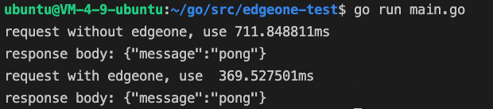
</p>
可以看到请求的耗时从 <strong>700+ms</strong> 提升到了 <strong>369ms</strong>, 客户体验也会得到极大的提升!

2. 接下来完成 CNAME 配置后，平台将自动检测当前 CNAME 状态是否已生效，如果在域名管理列表的状态一栏显示当前CNAME已生效，则当前域名已正确配置并开启加速, 接下来直接访问原域名即可获得如丝般顺滑的全新体验!
<p align="center">
  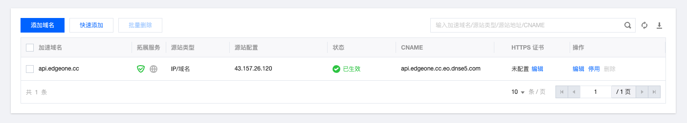
</p>

3. 同样, 静态资源也可以通过 EdgeOne 来获得更快的体验
为接入 EdgeOne 之前, 加载的总耗时达到了 <strong>1.22s</strong>, 客户访问会感觉到明显的卡顿
<p align="center">
  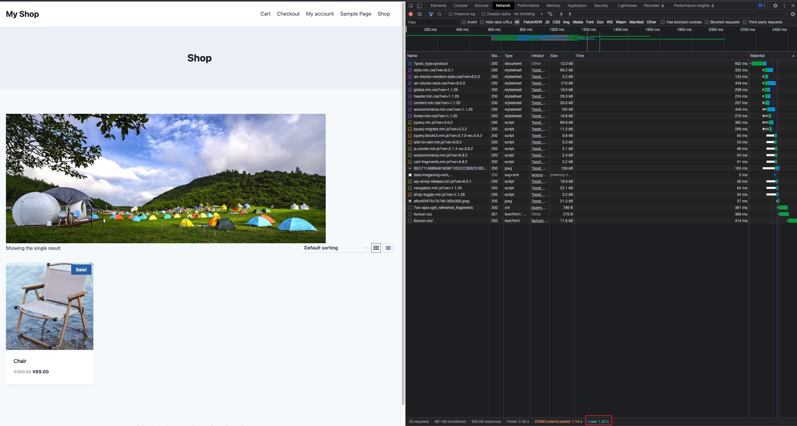
</p>

接入 EdgeOne 以后, 可以看到该站点的加载总耗时已缩短至 <strong>695ms</strong>, 客户体验获得了极大的提升
<p align="center">
  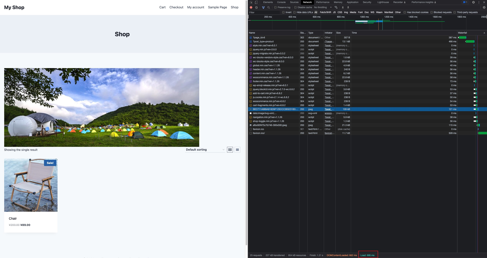
</p>

## 快速访问

- 如果您想了解我们还有哪些更丰富的能力, 可以访问[产品官网](https://cloud.tencent.com/product/teo)与[产品动态](https://cloud.tencent.com/document/product/1552/69824)，这里有 EdgeOne 最新的功能特性，以及历史版本功能迭代
- 如果您想了解更详细的接入步骤, 可以访问[EdgeOne 接入配置最佳实践](https://doc.weixin.qq.com/doc/w3_ABcACQaLACc6HK7H42nTUSQM00rQD?scode=AJEAIQdfAAoBPt83CBAO0AlgbdAFw)
- 如果您遇到了困难, 可以先参阅[常见问题](https://cloud.tencent.com/document/product/1552/70199)，这里整理开发者最常出现的问题，覆盖各个平台，希望可以帮助您快速解决问题
- <strong>腾讯云边缘加速平台开启春季回馈活动，限量免费体验产品，快来[申请](https://cloud.tencent.com/act/pro/edgeone_test-free?from=20230)吧！</strong>